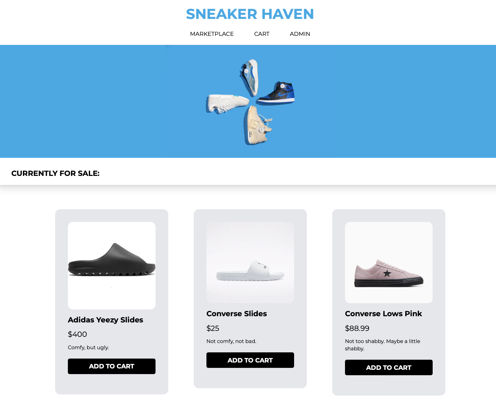
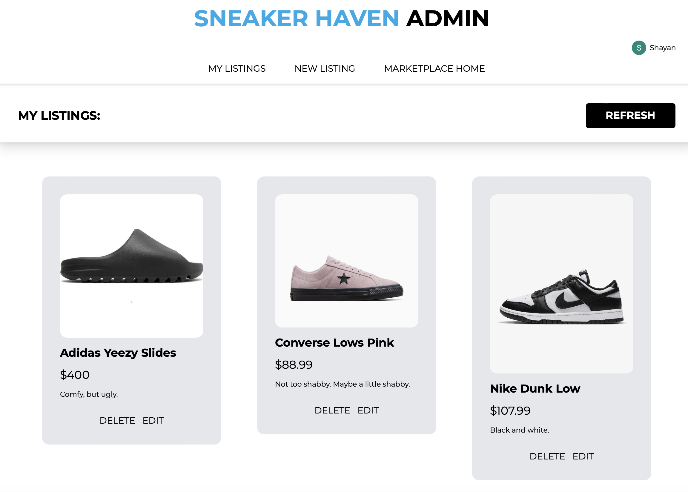
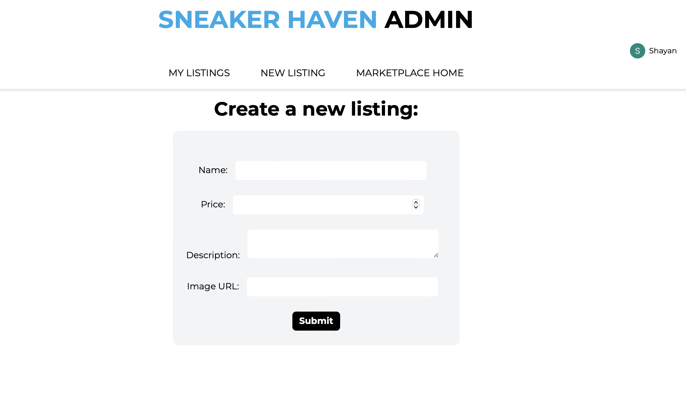
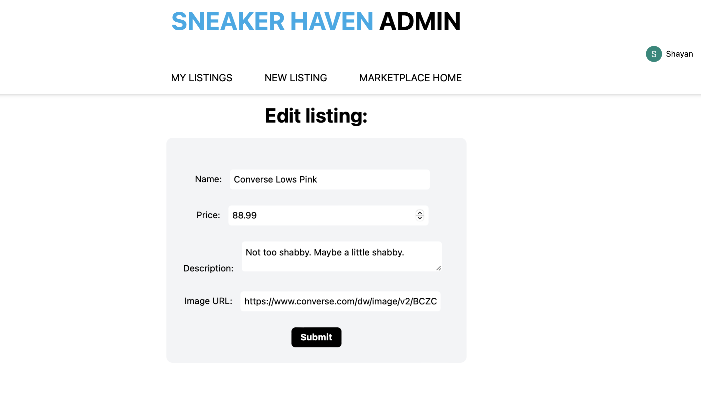
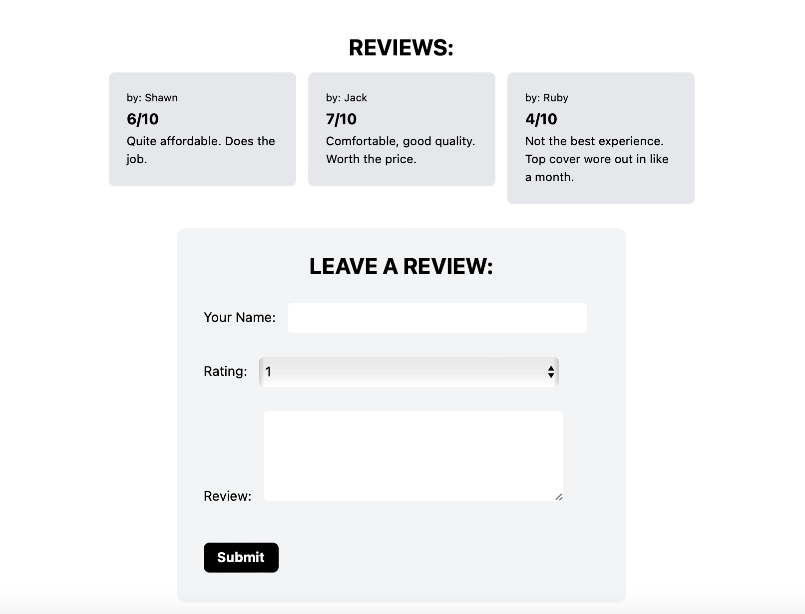
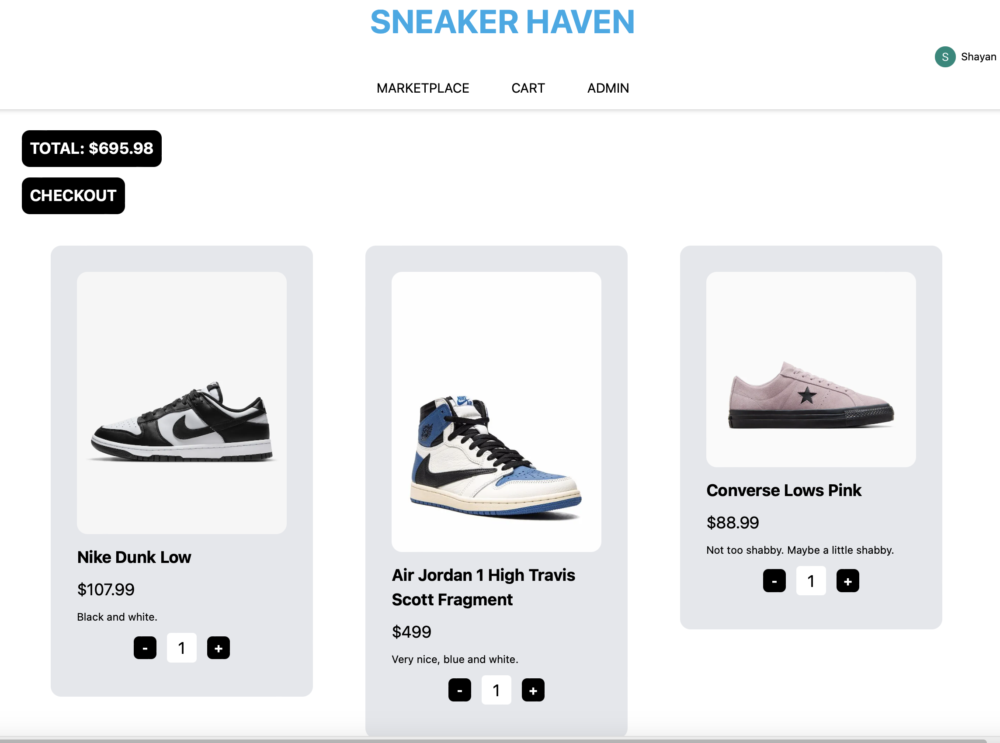

# E-Commerce-Sneaker-Haven
FULL STACK E-Commerce platform for sneakers, made using Next.js 14, React.js, MongoDB, Tailwind CSS, Clerk Authentication.
Link to deployed website: https://sneaker-haven-qvc1u24dn-shawn-nassabis-projects.vercel.app/shop

## HOME PAGE

## INDEPENDENT PRODUCT PAGES

## ADMIN PAGE

## CREATE LISTING

## EDIT LISTINGS

## ADD REVIEWS

## ADD/REMOVE FROM CART

